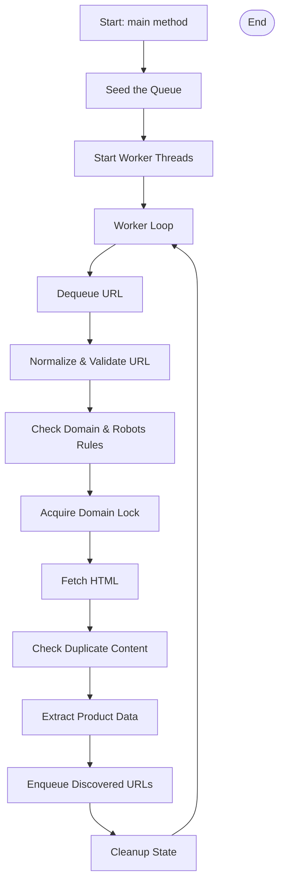
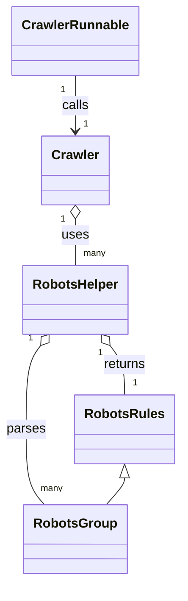

# 📦 CrawlerRunnable.java

The `CrawlerRunnable` class is a simple implementation of `Runnable` that continuously triggers the crawling process in an infinite loop. This class is designed to be executed by a thread, ensuring that the crawling process runs perpetually until the application is stopped.

---

### Main Responsibilities

- **Thread Execution**: Implements `Runnable` for multithreading.
- **Continuous Crawling**: Continuously invokes the `Crawler.crawl()` method.
- **Error Handling**: Catches IO and URI syntax exceptions, rethrowing them as unchecked exceptions.

---

### Key Code Snippet

```java
@Override
public void run() {
    while(true){
        try {
            Crawler.crawl();
        } catch (IOException e) {
            throw new RuntimeException(e);
        } catch (URISyntaxException e) {
            throw new RuntimeException(e);
        }
    }
}
```

---

### Use Case

- **Worker Thread**: Use as a worker in a thread pool to scale crawling tasks.
- **Fault Tolerance**: Ensures the crawler keeps running unless a critical error occurs.

---

# 🕷️ Crawler.java

The `Crawler` class orchestrates the main web crawling logic. It integrates Redis for queue management, uses Jsoup for HTML parsing, and leverages various checks to ensure efficient and respectful crawling.

---

### Core Features

- **Queue Management**: Uses Redis to manage URLs to crawl, retry, and dead queues.
- **Product Extraction**: Parses e-commerce product data from HTML.
- **URL Normalization**: Standardizes URLs for deduplication and processing.
- **Duplicate & Spam Prevention**: Uses BloomFilter and content hashing.
- **Respectful Crawling**: Enforces robots.txt and crawl delays per domain.
- **Concurrency**: Supports multi-threaded crawling using an `ExecutorService`.

---

### High-Level Flow



---

### Key Methods

- **`retrieveHTML(String url)`**: Fetches HTML from a given URL with Jsoup.
- **`normalizeUrl(String url)`**: Normalizes URLs for consistency.
- **`extractProductData(Document document)`**: Extracts product info and publishes to Redis.
- **`acquireDomainLock(String domain, int delay)`**: Ensures crawl delay is respected per domain.
- **`isValidData(String url)`**: Filters out invalid, spammy, or unwanted URLs.
- **`isDuplicateContent(String html)`**: Prevents scraping duplicate content.
- **`crawl()`**: Main crawling logic, processes a single URL.
- **`main(String[] args)`**: Entry point; seeds with initial URL and starts worker threads.

---

### Redis Keys Overview

| Key                   | Purpose                                       |
|-----------------------|-----------------------------------------------|
| `queue`               | Main queue of URLs to crawl                   |
| `queue:retry`         | Queue for URLs to retry                       |
| `queue:dead`          | Queue for failed URLs                         |
| `queue:processing`    | Currently processing URLs                     |
| `products`            | Extracted product data                        |
| `domain:lock:<domain>`| Domain-specific crawl lock                    |
| `domain:active:<domain>` | Tracks concurrent accesses per domain     |
| `visitedUrls`         | Set of already visited URLs                   |
| `seenUrls`            | Set of seen URLs (for deduplication)          |
| `content:hashes`      | Hashes of crawled content (for deduplication) |
| `url:retries`         | Hash with retry counts per URL                |
| `robots:<domain>`     | Cached robots.txt rules per domain            |

---

### Example: Product Extraction

```java
public static void extractProductData(Document document) {
    Elements products = document.select("li.product");
    for (Element product : products) {
        String productName = product.select(".product-name").text();
        String price = product.select(".product-price").text();
        String imgUrl = product.select(".product-image").attr("src");
        publishProduct(productName, price, imgUrl);
    }
}
```

---

### Notable Features

- **Politeness**: Respects robots.txt and crawl delay.
- **Scalability**: Can run multiple threads safely due to Redis-based state.
- **Error Handling**: Retries failed URLs, moves dead URLs after too many retries.
- **Data Extraction**: Specifically tailored for e-commerce product listings, but extensible.

---

# 🤖 RobotsHelper.java

The `RobotsHelper` class handles the fetching, parsing, and caching of `robots.txt` files. It helps ensure the crawler respects each site's restrictions and crawl delays.

---

### Responsibilities

- **Fetching robots.txt**: Downloads robots.txt for a domain.
- **Parsing robots.txt**: Extracts user-agent groups, allow/disallow rules, and crawl-delay.
- **Caching**: Stores parsed rules in Redis to avoid repeated fetching.
- **Rule Resolution**: Determines applicable rules for the crawler's user-agent.
- **Enforcement**: Checks if a given URL is allowed to be crawled.

---

### Core Method Example

```java
public static RobotsRules getRobotsRules(String domain) {
    String key = "robots:" + domain;
    try(Jedis jedis = getJedis()){
        String cached = jedis.get(key);
        if (cached != null) {
            return new Gson().fromJson(cached, RobotsRules.class);
        }
    }
    String robotsContent = fetchRobotsTxt(domain);
    RobotsRules parseRobotsRule = parseRobots(robotsContent,"*");
    try (Jedis jedis = getJedis()) {
        jedis.setex(key, 24 * 3600, new Gson().toJson(parseRobotsRule));
    }
    return parseRobotsRule;
}
```

---

### robots.txt Parsing Logic

- **Groups**: Each `user-agent` defines a new group.
- **Rules**: Each group contains `allow`, `disallow`, and optionally `crawl-delay`.
- **Resolution**: Finds the best matching group for a given user-agent.

---

### Example: Is URL Allowed?

```java
public static boolean isAllowedByRobots(String url, RobotsRules rules) {
    try {
        URI uri = new URI(url);
        String path = uri.getPath();
        for (String allow : rules.getAllowed()) {
            if (path.startsWith(allow)) return true;
        }
        for (String disallow : rules.getDisallowed()) {
            if (path.startsWith(disallow)) return false;
        }
        return true;
    } catch (Exception e) {
        return true;
    }
}
```

---

# RobotsGroup.java

The `RobotsGroup` class models a group of user-agents and their rules as parsed from robots.txt. This is an internal structure used by `RobotsHelper`.

---

### Fields

| Field              | Type            | Description                           |
|--------------------|-----------------|---------------------------------------|
| `userAgents`       | Set<String>     | Set of user-agents for this group     |
| `disallow`         | List<String>    | List of disallowed paths              |
| `allow`            | List<String>    | List of allowed paths                 |
| `crawlDelaySeconds`| Integer (nullable) | Optional crawl delay in seconds   |

---

### Usage

- **Encapsulation**: Used internally during parsing and rule resolution.
- **Flexibility**: Supports multiple user-agents per group and multiple rules.

---

### Code Example

```java
class RobotsGroup {
    Set<String> userAgents = new HashSet<>();
    List<String> disallow = new ArrayList<>();
    List<String> allow = new ArrayList<>();
    Integer crawlDelaySeconds = null;
}
```

---

# RobotsRules.java

The `RobotsRules` class encapsulates the resolved allow/disallow rules and crawl delay for a user-agent after parsing robots.txt.

---

### Fields

| Field         | Type           | Description                       |
|---------------|----------------|-----------------------------------|
| `disallowed`  | List<String>   | Disallowed URL patterns           |
| `allowed`     | List<String>   | Allowed URL patterns              |
| `crawlDelayMs`| int            | Crawl delay in milliseconds       |

---

### Methods

- **Getters/Setters**: For all fields.
- **Constructors**: Default and parameterized.
- **Default Behavior**: Default crawl delay is 1000 ms (1 second).

---

### Sample Usage

```java
RobotsRules rules = RobotsHelper.getRobotsRules("example.com");
if (RobotsHelper.isAllowedByRobots(url, rules)) {
    // Safe to crawl
}
```

---

# 🛠️ GenericHelper.java

The `GenericHelper` class appears to be a utility or scratch file, possibly for quick testing of string operations or Redis connections. Its main method demonstrates simple string splitting.

---

### Key Elements

- **String Split Demo**: Splits a string on `#` and tries to access the third segment.
- **Static Redis Connection**: Instantiates a Jedis connection, but does not use it in the main method.

---

### Example Code

```java
public static void main(String[] args) {
    String rawLine = "#Hello#1";
    String line = rawLine.split("#")[2].trim();
    System.out.println(line);
}
```

---

### Possible Uses

- **Testbed**: For experimenting with code snippets.
- **Utility Functions**: Could be expanded for generic helpers.

---

```card
{
    "title": "Utility File Warning",
    "content": "GenericHelper.java is not used by main logic and may not be production-ready."
}
```

---

# 🏗️ Class Structure Overview

The main crawler is composed of modular classes for crawling, robots.txt handling, and queue management. Below is a class diagram to illustrate the relationships:



---

# 🚦 Concurrency and Workflow

The crawler is designed to run with multiple threads, each executing the crawl loop independently. Redis is used for synchronization, making this architecture scalable and fault-tolerant.

---

```card
{
    "title": "Best Practice",
    "content": "Always use distributed locks and queues (like Redis) for scalable, robust crawling."
}
```

---

# Summary

- **CrawlerRunnable** runs the crawling loop in threads.
- **Crawler** manages URL queues, HTML retrieval, product extraction, duplicate prevention, and respects robots.txt.
- **RobotsHelper** fetches and parses robots.txt, caches rules, and checks crawl permissions.
- **RobotsGroup** and **RobotsRules** model robots.txt rules.
- **GenericHelper** is a test utility, not tied to core crawler logic.

This modular design ensures the crawler is respectful, robust, and scalable for large-scale web crawling tasks.